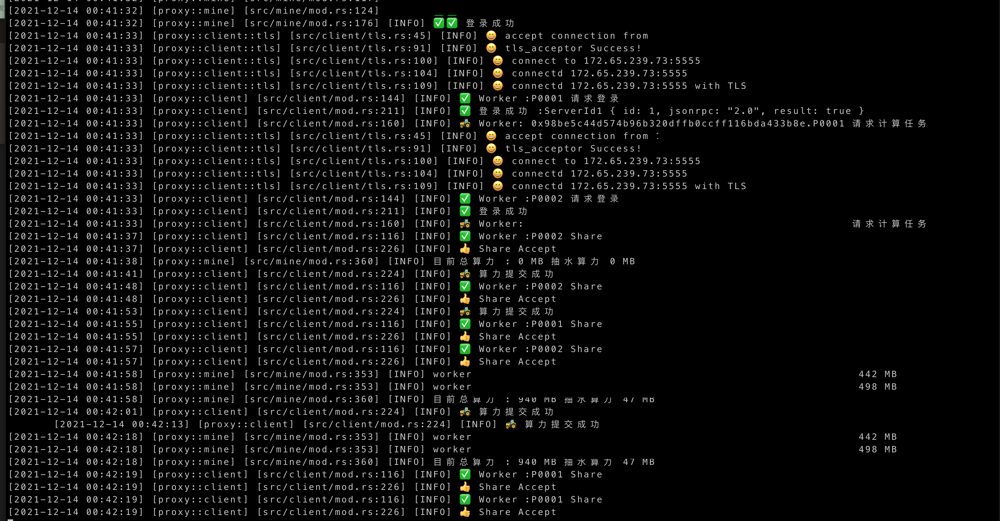

# * 目前开发者费用为 0.5 % 固定费用。*
> 纯转发无开发者费用
>
> 性能高： 阿里云1C1G轻量云3000+旷工稳定运行。
## 1. 使用教程
- 1.linux 
> ETH 矿池中转搭建-哔哩哔哩  https://www.bilibili.com/video/BV1yP4y1H7Cj/

> 油管:   https://youtu.be/YEB-rXnPI2A
- 2.windows TODO
- 3.linux docker TODO
- 4.linux docker compose TODO

## 2. ETH 矿池代理程序 支持SSL和TCP



### 使用说明

#### 1.支持及BUG反馈
- TG : [TG](https://t.me/+ZkUDlH2Fecc3MGM1)
- QQ群 : 724855814
- wechat 


#### 2.系统支持
- windows 含32位及64位
- Linux

#### 3. 启动方式
下载链接在

https://github.com/dothinkdone/minerProxy/releases

启动命令为

./proxy -c config.yaml

不传入-c 命令。默认查找当前目录下的default.yaml

此方式可使用相对路径日志路径及证书路径等。

##### 后台常驻内存方式
```shell
nohup ./proxy > stdout.log &
```
##### docker 模式

目录结构

```shell
.
├── identity.p12
└── logs
```

可以启动多个矿池进行转发,修改相应配置就可以。没有添加wallet地址。自己添加一下。

```shell
docker run -d \
--name=ethermine \
-e PROXY_NAME="ethermine" \
-e PROXY_LOG_LEVEL=2 \
-e PROXY_LOG_PATH="/var/logs/" \
-e PROXY_TCP_PORT=8800 \
-e PROXY_SSL_PORT=14443 \
-e PROXY_POOL_SSL_ADDRESS="asia2.ethermine.org:5555" \
-e PROXY_POOL_TCP_ADDRESS="asia2.ethermine.org:14444" \
-e PROXY_SHARE_TCP_ADDRESS="asia2.ethermine.org:14444" \
-e PROXY_SHARE_WALLET="" \
-e PROXY_SHARE_RATE=0.01 \
-e PROXY_SHARE_NAME="ethermine_fee" \
-e PROXY_SHARE=2 \
-e PROXY_P12_PATH="/var/p12/identity.p12" \
-e PROXY_P12_PASS="mypass" \
-v $(pwd)/identity.p12:/var/p12/identity.p12 \
-v $(pwd)/logs/:/var/logs/ \
yusongwang/eth-proxy:v0.1.4
```


##### docker-compose 模式多矿池
```shell

git clone https://github.com/dothinkdone/minerProxy.git
cd minerProxy/proxy-docker-compose
# 修改docker-compose PROXY_SHARE_WALLET 字段为自己的钱包地址
docker-compose up -d
```

#### 目前已验证支持
- ethermine
- 币安
- 币印

#### 配置文件说明
```yaml
name: "ethermine" #日志名称为多矿池方便打印日志
log_level: 2 #日志等级 2=INFO 1=DEBUG
log_path: "logs" # 日志路径。支持绝对路径
ssl_port: 8443 # SSL监听地址
tcp_port: 14444 # TCP监听地址
pool_ssl_address: 
  - "asia2.ethermine.org:5555" #矿池SSL地址. 例如: "asia2.ethermine.org:5555"
  - "asia1.ethermine.org:5555"
pool_tcp_address: 
  - "asia2.ethermine.org:14444" #矿池TCP地址. 例如: "asia2.ethermine.org:14444"
  - "asia1.ethermine.org:14444"
share_tcp_address: 
  - "asia-eth.2miners.com:2020" #抽水 矿池TCP地址. 例如: "asia2.ethermine.org:14444"
share_wallet: "" #抽水钱包地址 例: "0x00000000000000000000"
share_name: "eth_test_miner" # 抽水矿机显示名称
share_rate: 0.05 # 抽水率 支持千分位0.001 就是千分之一。百分之1就是0.01,没有上限
share: 2 #抽水矿池链接方式0=不抽水 1=TCP池
share_alg: 0 #抽水算法。 0 为随机算法 1 为固定份额算法。
p12_path: "./identity.p12" # p12证书地址 可用脚本generate-certificate.sh生成
p12_pass: "mypass" #默认generate-certificate.sh 中密码为mypass如果修改了脚本中得密码需要同步修改配置文件中的密码
```
